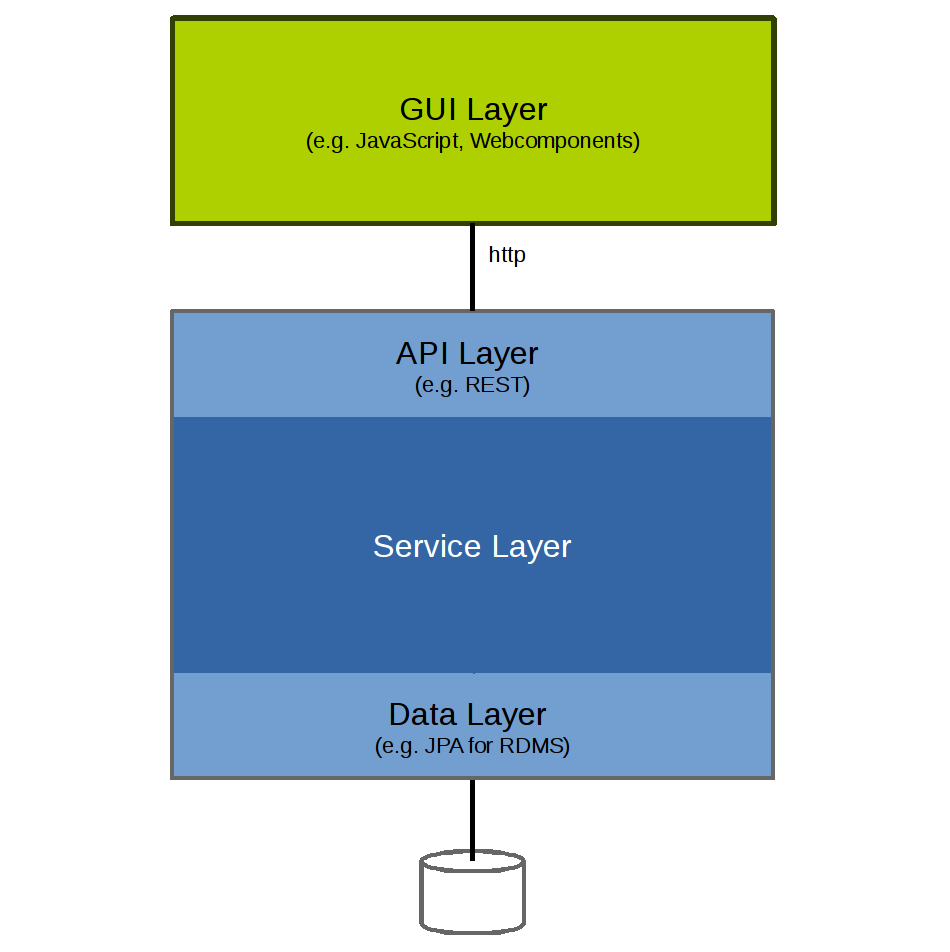

# Application Basics

The RefArch uses the same basic structure for small applications and distributed systems. This keeps the transition from a compact application to a multi-service setup straightforward.

## Shared structure

Every application is built around the same responsibilities:

- an API as the exposed application interface
- an application or service layer containing business logic
- a data access layer for persistent storage
- optional integration logic for communication with external systems

If an application needs to communicate with surrounding systems, this integration logic should be kept separate from the core business logic. In the RefArch ecosystem this is typically implemented with dedicated integration components or EAI artifacts.

## Base application with GUI

The frontend communicates with the application exclusively through the API. This keeps the UI decoupled from backend implementation details and allows independent delivery of different user interfaces.

Base application with GUI:

This pattern works for both monolithic and distributed applications. It also supports multiple views on the same application, for example when different user groups require separate frontend experiences while sharing the same business capabilities.
