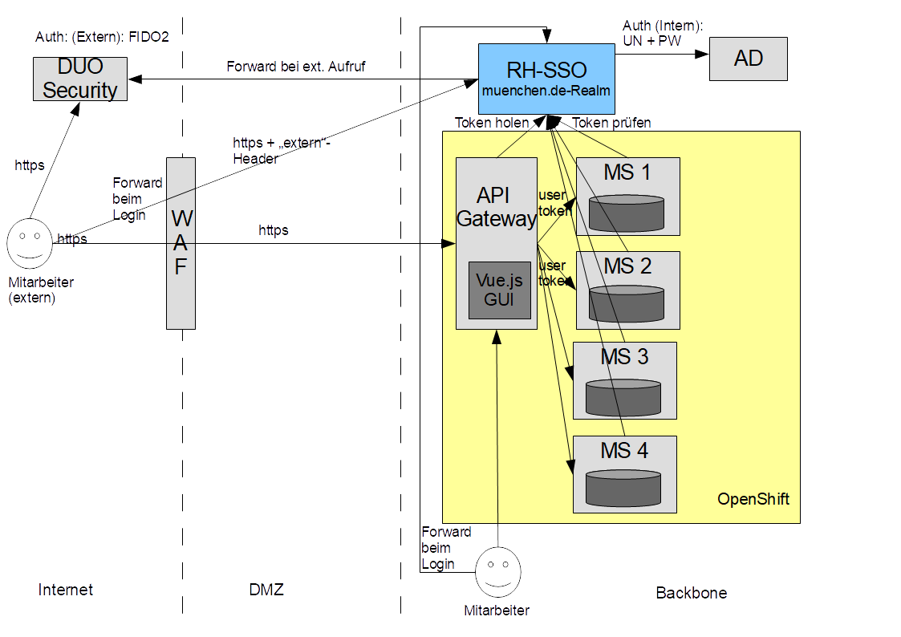
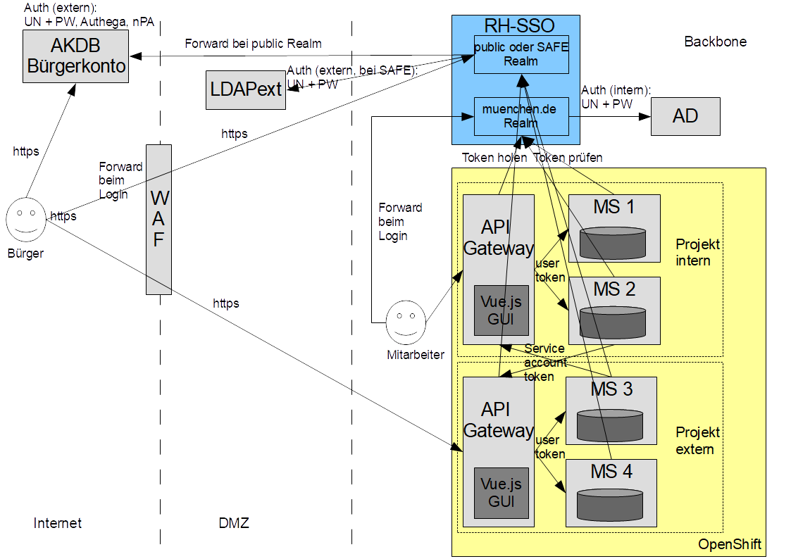

# External Access

The historic RefArch architecture distinguishes two common patterns for access from outside the internal network. The exact infrastructure products can vary, but the architectural ideas remain the same.

## Scenario 1: Internal users via the internet

This scenario covers applications that are primarily intended for internal users but must also be reachable from arbitrary devices over the internet.

External access for internal users:

Typical characteristics of this setup are:

- the application still runs completely on the internal container platform
- access from the internet is terminated and filtered at a web application firewall or equivalent edge layer
- users authenticate against the same identity provider used for internal access
- strong authentication such as a second factor can be enforced for internet traffic

## Scenario 2: External and internal users

This scenario covers applications that must be used by users without internal accounts, such as citizens, companies or partner organizations.

External and internal user access:

Typical characteristics of this setup are:

- external users authenticate against a dedicated external identity context
- internal and external access are often separated into different projects or clients
- communication between the internal and external parts should happen through explicit service-to-service integration
- service accounts are used for controlled cross-project access

When both internal and external identities must be supported, separating these concerns at the architectural level keeps authentication, authorization and operational boundaries manageable.
