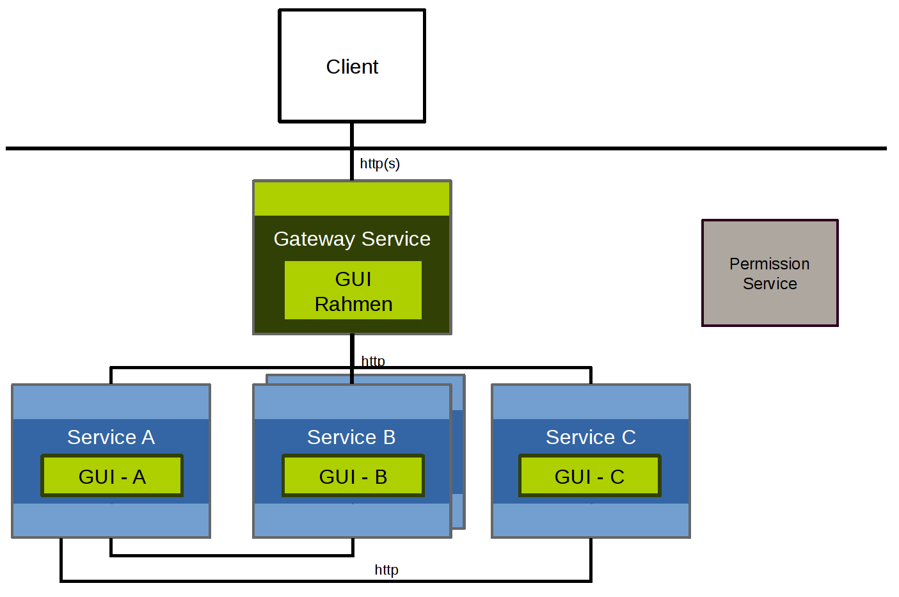

# Frontend Architecture

RefArch applications usually provide one or more graphical user interfaces for interacting with backend services. The architecture supports both centralized and distributed UI composition.

## Centralized frontend

In the centralized model, one frontend provides the user-facing application shell and coordinates access to backend capabilities.

Centralized frontend architecture:

This remains the default pattern because it is easier to build, operate and reason about than a distributed UI. In the current RefArch implementation, the frontend is built and deployed separately from the gateway as described in [ADR001](../cross-cutting-concepts/adr/001-separate_gateway_and_frontend.md), but it still forms one coherent frontend for the application.

## Distributed frontend

In the distributed model, UI parts are delivered by multiple services and combined into one user experience.

Distributed frontend architecture:

This pattern can be useful for micro frontend scenarios, for example when web components from different teams need to be integrated into a shared application shell. It also introduces additional integration effort and should only be chosen when the added modularity is needed.

## Current recommendation

The current default is:

- one dedicated frontend service for the main UI
- one API gateway as the external backend entry point
- optional web components for modular frontend extensions

This keeps the standard setup simple while leaving room for more distributed frontend architectures when required.
