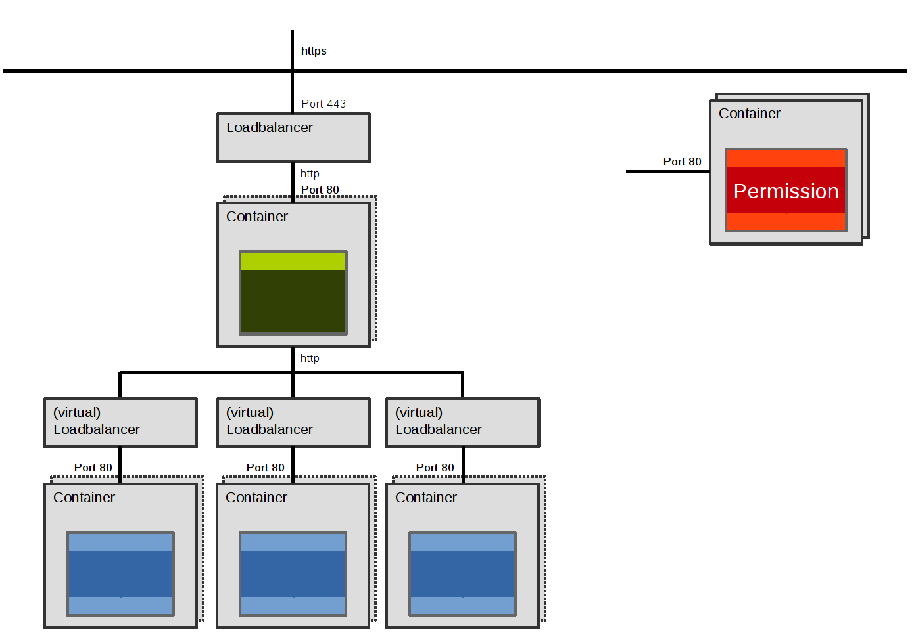
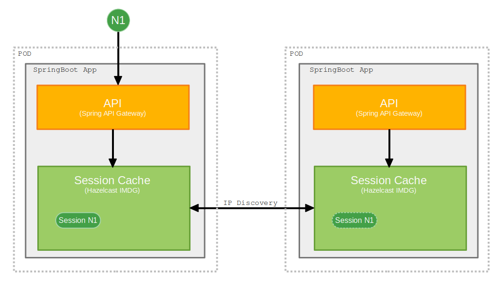

# Infrastructure

RefArch applications are intended to run in a container-based environment. Each deployable unit is packaged as its own container image and operated as an independent service.

## Container platform

The platform is responsible for:

- running the desired number of service instances
- routing traffic to healthy instances
- enabling scaling of individual components
- providing stable service discovery inside the cluster

Container-based runtime topology:

This setup allows services to communicate through stable internal addresses while the platform manages the actual container instances behind those addresses.

## Deployment and configuration

Deployment descriptors and runtime configuration should be treated as code and versioned alongside the application. This allows repeatable rollouts and consistent promotion across environments.

## Session resilience for multiple gateway instances

If gateway instances are scaled horizontally, session information can be synchronized across instances so that a planned instance replacement does not invalidate active sessions.

Session synchronization with Hazelcast:

The concrete RefArch gateway support for this setup is documented in the [API Gateway](../gateway.md#hazelcast) page.

## Search as an optional capability

Applications with full-text, fuzzy, geo or analytics-oriented search requirements typically use a dedicated search service instead of pushing those use cases into the transactional database. The historic RefArch documentation used Elasticsearch as an example of such a specialized search component.
