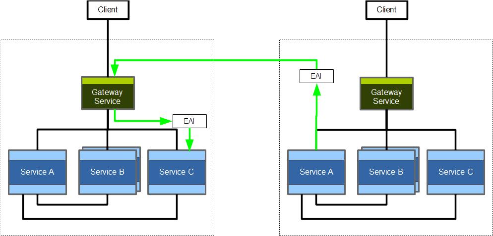
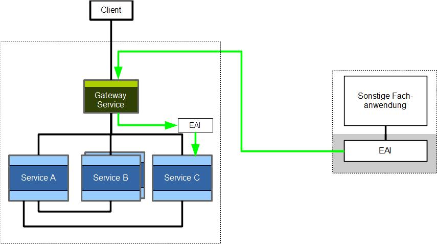

# Integration Patterns

RefArch applications integrate with each other and with external systems through explicit integration boundaries instead of tightly coupling business services.

## RefArch to RefArch integration

Communication between two RefArch-based applications should pass through the receiving application's gateway and use dedicated integration artifacts on both sides.

RefArch to RefArch integration:

This keeps authentication and authorization consistent and avoids coupling the lifecycle of two business applications too tightly.

## RefArch to non-RefArch integration

The same principle also applies when integrating with purchased software or other non-RefArch systems.

RefArch to external system integration:

The integration logic should remain separate from the application core. In the RefArch ecosystem, this is commonly realized with EAI components based on the provided integration patterns and templates.
