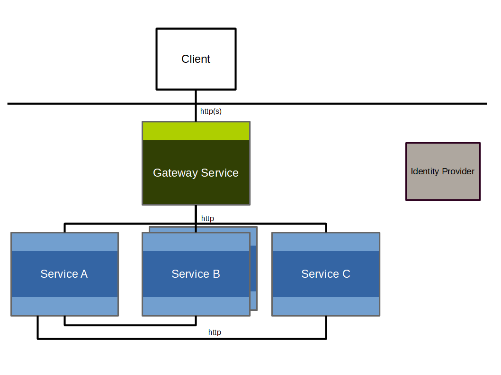

# Microservice Applications

The RefArch is designed for applications that can start small and evolve into a microservice-based system when the domain or operational requirements justify it.

## Why microservices

Microservices help split a larger application into smaller, independently deployable services. This is especially useful when teams want to:

- release changes for one capability without redeploying the whole application
- scale only the parts that are resource intensive
- isolate failures to a subset of the overall system
- choose service boundaries that reflect business capabilities

The main tradeoff is increased integration and operational complexity. Service boundaries should therefore be chosen carefully to keep coupling low and cohesion high.

Domain-driven design can help with this decomposition by identifying bounded contexts and clear ownership of business capabilities.

## Typical runtime structure

In a RefArch-based microservice application, external communication is concentrated at the gateway while domain-specific processing happens in dedicated backend services.

Microservice application architecture:

The gateway provides the external entry point, while backend services encapsulate business logic and data access.

## Gateway responsibilities

The gateway coordinates communication with the outside world. Typical responsibilities are:

- exposing one consistent entry point for clients
- routing requests to backend services
- shielding internal-only APIs from public access
- handling cross-cutting concerns such as authentication

Implementation details of the current gateway are documented on the [API Gateway](../gateway.md) page.

## Service responsibilities

Backend services process domain data and implement business rules. They should be deployable and testable independently. Communication between services should remain explicit and limited to well-defined interfaces.

## Authentication and authorization

Authentication is initiated at the gateway, while backend services enforce authorization for protected business operations.

The current security implementation details, including token handling and authorization strategies, are documented on the [Security](../cross-cutting-concepts/security.md) page.
