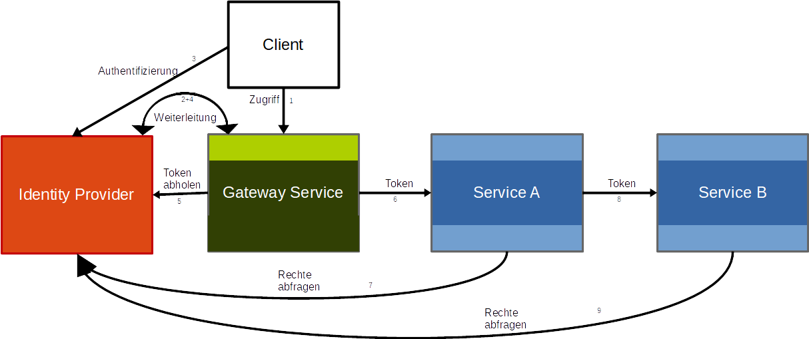

# Security Flows

This page describes the main authentication and authorization flows at an architectural level. Concrete implementation details and configuration options are documented on the [Security](../cross-cutting-concepts/security.md) page.

## Authentication and authorization overview

Authentication and authorization of user requests are split between the gateway and the backend services.

Authentication and authorization flow:

The gateway handles the user-facing login flow and forwards authenticated requests to backend services. Backend services validate the incoming token and enforce authorization for protected operations.

## Login

The typical login flow is:

1. A user opens the application through the gateway.
2. If no authenticated session exists, the gateway redirects the user to the configured OpenID Connect provider.
3. After successful authentication, the gateway stores the resulting session information and delivers the frontend.

## Backend access

After login, frontend requests reach backend services through the gateway.

The architectural principles are:

- backend calls are routed through the gateway
- the gateway forwards authenticated requests with a token usable by the backend
- each backend service validates the token before executing business logic
- authorization is enforced in the backend, not only in the UI

## Logout behavior

Two logout variants are typically relevant:

- local logout, which ends the session in the application
- global logout, which additionally ends the identity-provider session

Local logout is often sufficient for day-to-day usage, while global logout can be provided when the security requirements call for it.

## Authorization checks in services

Authorization checks belong in the backend services because UI-level checks are only a usability feature.

Depending on the chosen authorization model, services either:

- derive roles directly from the token
- resolve additional permissions from the identity provider

If additional permissions are resolved remotely, they should be cached for the token lifetime or another short bounded period to avoid unnecessary calls to the identity provider.
