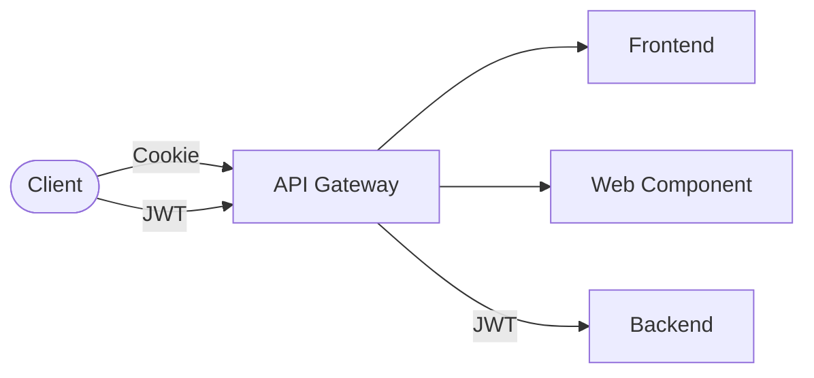

# Security

This page informs about certain security related topics.

## Auth



For authentication and authorization the RefArch uses OAuth 2.0 and OpenID Connect.
The authentication between the clients and the API gateway can be different depending on client and request type (see [Routing](../gateway.md#routing)).
The traffic between API gateway and the backend is always authenticated with JWTs.

::: info
Our base principle for authentication and authorization is to follow the specifications of JWT and OAuth 2.0 as close as possible.
This e.g. means using [defined claims](https://www.iana.org/assignments/jwt/jwt.xhtml) and Keycloak default scopes wherever possible instead of introducing new ones.
:::

### Authorization

Authorization is only done in the backend leveraging [Spring Securities authorization features](https://docs.spring.io/spring-security/reference/servlet/authorization/index.html).
In specific, we use [Method Security](https://docs.spring.io/spring-security/reference/servlet/authorization/method-security.html) which allows fine-grained access control on method level via specific security annotations.

These annotations check the authorities (scopes, permissions, roles) a user has. These are extracted from the JWT provided for authentication.
A so-called authorities converter specifies how the authorities are extracted from the JWT.

OAuth 2.0 and OpenID Connect don't specify any authorization for applications themselves, so following authorities converters are coupled to our used identity provider Keycloak.
In general, they should work with other identity providers (e.g. by configuring a mapper) but are not tested.

The backend template provides two implementations which are described in the following.

::: info Suggested implementation
In contrast to permissions, roles are a more commonly supported concept in OAuth 2.0 and OpenID Connect identity providers.
Therefore, roles offer higher interoperability and are the suggested option. Roles are used by default in the templates.

Once an application has decided on one or the other, it's perfectly fine to remove the unneeded implementation or switch the default.
:::

#### Keycloak roles (Default)

Keycloak comes with a built in `roles` scope and corresponding realm mapper, which maps all client roles to the `resource_access.<client id>.roles` claim.
The provided authorities converter implementation (`KeycloakRolesAuthoritiesConverter.java`) takes this claim and maps it to Spring authorities.
During this mapping the roles are prefixed with `ROLE_`, which Spring Security expects to interpret a granted authority as role.

#### Keycloak permissions

::: warning Custom Plugin
Currently this implementation relies on a custom Keycloak plugin which maps the Keycloak authorization permission into the
`authorities` claim of the user info endpoint. Also, the plugin needs to be activated per client by adding a mapper.

_The plugin will be made available as open source code in the near future._
:::

This implementation (`UserInfoAuthoritiesConverter.java`) uses permissions for authorization and retrieves them from the `authorities` claim exposed by the user-info endpoint.
The resolved permissions are cached (default 1 minute).

::: info
Because roles are the default in the templates, permission-based authorization must be explicitly enabled via the `userinfo-authorities` Spring profile.
:::

### User attributes

Some applications require additional user information.
In that case, there are multiple scopes that append the necessary information to the JWT.

- `profile`: Default OpenID scope which adds e.g. `preferred_username`, `given_name`, `family_name` and `name` claims
- `email`: Default OpenID scope which adds `email` claim
- `lhm-core`: LHM custom scope which adds **TBD**

### Client validation

For further security the backend can validate if the token has been explicitly issued for the desired client.
This is done by checking if the client is contained in the `aud` claim, but this requires a mapper.
See [Spring](https://docs.spring.io/spring-security/reference/servlet/oauth2/resource-server/jwt.html#_supplying_audiences) and
[Keycloak](https://www.keycloak.org/docs/latest/server_admin/#_audience_resolve) docs.

See below for the corresponding backend configuration.

```yaml
spring:
  security:
    oauth2:
      resourceserver:
        jwt:
          audiences:
            - <client id>
```

## Disable SBOM Exposing

All services developed with the [templates](../overview.md#templates), as well as all ready-to-use components like the [API Gateway](../overview.md#api-gateway) expose a SBOM (Software Bill of Materials) endpoint at `/actuator/sbom/application` by default.

This can be a problem for closed-source projects using any of the RefArch components, as it exposes information about the software dependencies and might thus lead to expose of critical CVEs.

More information about SBOMs in general and the [CycloneDX](https://cyclonedx.org/) format we use, can be found in the [official CycloneDX documentation](https://cyclonedx.org/specification/overview/).

The following sections will describe how to disable the SBOM endpoint in the various components.

### API Gateway

The API Gateway is built using [cyclonedx-maven-plugin](https://github.com/CycloneDX/cyclonedx-maven-plugin) and the generated SBOM file is exposed via the Spring-provided [SBOM actuator endpoint](https://docs.spring.io/spring-boot/api/rest/actuator/sbom.html).

To disable the exposure the endpoint must be disabled through runtime configuration.
This can be easily achieved by e.g. setting the environment variable `MANAGEMENT_ENDPOINT_SBOM_ACCESS` to `none` or alter the underlying Spring property.

### Java-based templates

Java-based templates use the same SBOM generation as the [API Gateway](#api-gateway).

Thus, the SBOM exposure can be disabled the same way using runtime configuration.
Alternatively, it can be disabled by altering the `application.yml` file and removing `sbom` endpoint:

```yaml
management:
  endpoints:
    web:
      exposure:
        include:
          - sbom # remove this line
  endpoint:
    sbom: # remove this line
      access: read_only # remove this line
```

### Node-based templates

The SBOM file is generated using [cyclonedx-node-npm](https://github.com/CycloneDX/cyclonedx-node-npm) and directly integrated into the `npm run build` script.
It's placed inside the `dist` folder together will all other static resources and then served via the nginx server at runtime of the OCI image through a custom defined endpoint.

To disable the exposure the behaviour of the nginx server has to be altered.
This can be easily achieved by removing the following content from the file `sbom.conf` in the `docker/nginx` directory of the corresponding template.

```text
location /actuator/sbom/application {
    access_log off;
    add_header 'Content-Type' 'application/json';
    add_header 'Access-Control-Allow-Methods' 'GET, OPTIONS' always;
    add_header Cache-Control 'no-cache';
    alias /opt/app-root/src/application.cdx.json;
}
```

:::danger Important
Note that you must not remove the file `sbom.conf` altogether as this enables serving the generated SBOM file as a regular static resource.
:::
