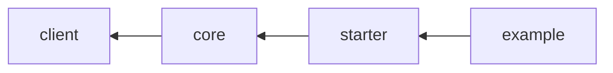

# CoSys Integration

Integration for creating documents with [coSys](https://www.cib.de/cosys/).

## Modules

The modules follow the [default naming convention](./index.md#naming-conventions).

### Dependency graph

The following graph shows the relationships between the various modules and how they interact and rely on each other.



## Usage

```xml
<dependencies>
    <dependency>
        <groupId>de.muenchen.refarch</groupId>
        <artifactId>refarch-cosys-integration-starter</artifactId>
        <version>...</version>
    </dependency>
</dependencies>
```

## Configuration

Following are the properties to configure the different modules. Some of them are custom defined and others are synonyms
for spring package properties.
Whether a property is an alias can be checked in the corresponding `application.yml` of each module.

### refarch-cosys-integration-starter

| Property                             | Description              | Example          |
| ------------------------------------ | ------------------------ | ---------------- |
| `refarch.cosys.url`                  | Url of the CoSys service |                  |
| `refarch.cosys.merge.datafile`       |                          | `/root/multi`    |
| `refarch.cosys.merge.inputLanguage`  | incoming language        | `Deutsch`        |
| `refarch.cosys.merge.outputLanguage` | outgoing language        | `Deutsch`        |
| `refarch.cosys.merge.keepFields`     |                          | `unresolved-ref` |

For authentication against cosys a OAuth2 registration with the name `cosys` needs to be provided.
See following example or the [according Spring documentation](https://docs.spring.io/spring-security/reference/servlet/oauth2/index.html#oauth2-client).

```yml
spring:
  security:
    oauth2:
      client:
        provider:
          sso:
            issuer-uri: https://sso.example.com/auth/realms/refarch
            user-info-uri: ${spring.security.oauth2.client.provider.sso.issuer-uri}/protocol/openid-connect/userinfo
            jwk-set-uri: ${spring.security.oauth2.client.provider.sso.issuer-uri}/protocol/openid-connect/certs
        registration:
          cosys:
            provider: sso
            authorization-grant-type: client_credentials
            client-id: refarch_client
            client-secret: client_secret_123
```
