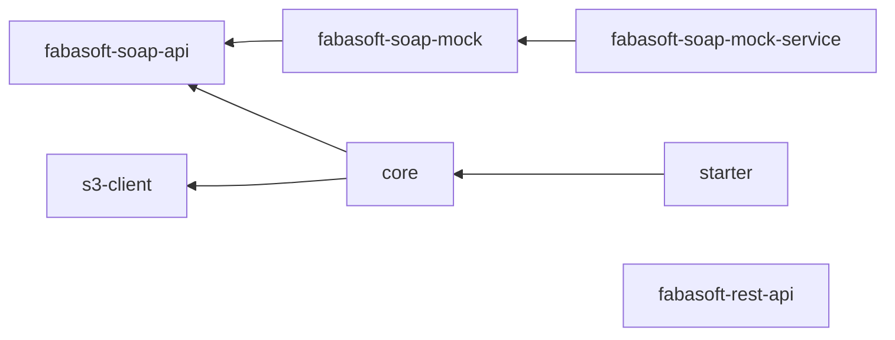

# DMS Integration

Integration for CRUD operations on a dms system in specific fabasoft. Uses [s3-integration](./s3.md) for file handling.

## Modules

The modules follow the [default naming convention](./index.md#naming-conventions).

Beside the default modules there are following additional:

- soap-api: Interface for accessing the SOAP-API of the underlying service.
- soap-mock: Mock for testing purposes of soap-api.
- rest-api: Interface for accessing the REST-API of the underlying service. Alternative for soap-api currently not used by integration.

### Dependency graph

The following graph shows the relationships between the various modules and how they interact and rely on each other.



## Usage

```xml

<dependencies>
    <dependency>
        <groupId>de.muenchen.refarch</groupId>
        <artifactId>refarch-dms-integration-starter</artifactId>
        <version>...</version>
    </dependency>
</dependencies>
```

Additionally, a specific `s3-integration-*-client-starter` is required as dependency, because S3 is used for file handling.
See [according documentation](./s3.md#usage).

## Configuration

### refarch-dms-integration-starter

| Property                                  | Description                                                                                                    |
|-------------------------------------------|----------------------------------------------------------------------------------------------------------------|
| `refarch.dms.fabasoft.url`                | Url to fabasoft endpoint                                                                                       |
| `refarch.dms.fabasoft.username`           | Technical fabasoft dms user                                                                                    |
| `refarch.dms.fabasoft.password`           | Technical fabasoft dms password                                                                                |
| `refarch.dms.fabasoft.businessapp`        | App registered in the DMS                                                                                      |
| `refarch.dms.fabasoft.ui-url`             | Url to fabasoft web interface used for ui link in object metadata                                              |
| `refarch.dms.fabasoft.enable-mtom`        | Flag to enable SOAP message transmission optimization                                                          |
| `refarch.dms.supported-file-extensions.*` | Map of allowed file extensions in the format "extension (key): mime-type (value)". I.e. "pdf: application/pdf" |
