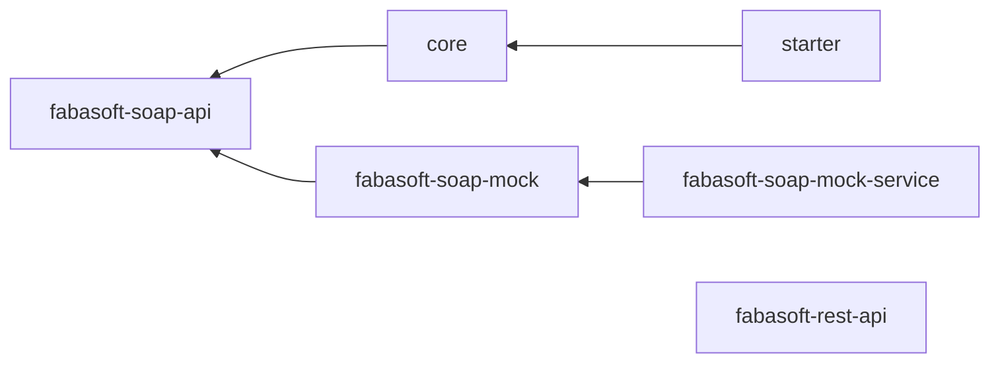

# DMS Integration

Integration for CRUD operations on a dms system in specific fabasoft.

## Modules

The modules follow the [default naming convention](./index.md#naming-conventions).

Besides the default modules we provide the additional ones:

- `soap-api`: Interface for accessing the SOAP-API of the underlying service.
- `soap-mock`: Mock for testing purposes of soap-api.
- `rest-api`: Interface for accessing the REST-API of the underlying service. Alternative to soap-api but can't currently be used as drop-in-replacement.

### Dependency graph

The following graph shows the relationships between the various modules and how they interact and rely on each other.


```mermaid
flowchart RL
    starter --> core --> fabasoft-soap-api
    fabasoft-soap-mock-service --> fabasoft-soap-mock --> fabasoft-soap-api
    fabasoft-rest-api
```

## Usage

Add the following dependency for using the dms integration.

```xml
<dependencies>
    <dependency>
        <groupId>de.muenchen.oss.refarch</groupId>
        <artifactId>refarch-dms-integration-starter</artifactId>
        <version>...</version>
    </dependency>
</dependencies>
```

After that the following `OutPort`s can be used for accessing DMS/eAkte (e.g. via autowiring, as ports are available as bean):

- [CancelObjectOutPort](https://github.com/it-at-m/refarch/blob/main/refarch-integrations/refarch-dms-integration/refarch-dms-integration-core/src/main/java/de/muenchen/refarch/integration/dms/application/port/out/CancelObjectOutPort.java)
- [CreateDocumentOutPort](https://github.com/it-at-m/refarch/blob/main/refarch-integrations/refarch-dms-integration/refarch-dms-integration-core/src/main/java/de/muenchen/refarch/integration/dms/application/port/out/CreateDocumentOutPort.java)
- [CreateFileOutPort](https://github.com/it-at-m/refarch/blob/main/refarch-integrations/refarch-dms-integration/refarch-dms-integration-core/src/main/java/de/muenchen/refarch/integration/dms/application/port/out/CreateFileOutPort.java)
- [CreateProcedureOutPort](https://github.com/it-at-m/refarch/blob/main/refarch-integrations/refarch-dms-integration/refarch-dms-integration-core/src/main/java/de/muenchen/refarch/integration/dms/application/port/out/CreateProcedureOutPort.java)
- [DepositObjectOutPort](https://github.com/it-at-m/refarch/blob/main/refarch-integrations/refarch-dms-integration/refarch-dms-integration-core/src/main/java/de/muenchen/refarch/integration/dms/application/port/out/DepositObjectOutPort.java)
- [ListContentOutPort](https://github.com/it-at-m/refarch/blob/main/refarch-integrations/refarch-dms-integration/refarch-dms-integration-core/src/main/java/de/muenchen/refarch/integration/dms/application/port/out/ListContentOutPort.java)
- [ReadContentOutPort](https://github.com/it-at-m/refarch/blob/main/refarch-integrations/refarch-dms-integration/refarch-dms-integration-core/src/main/java/de/muenchen/refarch/integration/dms/application/port/out/ReadContentOutPort.java)
- [ReadMetadataOutPort](https://github.com/it-at-m/refarch/blob/main/refarch-integrations/refarch-dms-integration/refarch-dms-integration-core/src/main/java/de/muenchen/refarch/integration/dms/application/port/out/ReadMetadataOutPort.java)
- [SearchFileOutPort](https://github.com/it-at-m/refarch/blob/main/refarch-integrations/refarch-dms-integration/refarch-dms-integration-core/src/main/java/de/muenchen/refarch/integration/dms/application/port/out/SearchFileOutPort.java)
- [SearchSubjectAreaOutPort](https://github.com/it-at-m/refarch/blob/main/refarch-integrations/refarch-dms-integration/refarch-dms-integration-core/src/main/java/de/muenchen/refarch/integration/dms/application/port/out/SearchSubjectAreaOutPort.java)
- [UpdateDocumentOutPort](https://github.com/it-at-m/refarch/blob/main/refarch-integrations/refarch-dms-integration/refarch-dms-integration-core/src/main/java/de/muenchen/refarch/integration/dms/application/port/out/UpdateDocumentOutPort.java)

## Configuration

### refarch-dms-integration-starter

| Property                                  | Description                                                                                                    |
| ----------------------------------------- | -------------------------------------------------------------------------------------------------------------- |
| `refarch.dms.fabasoft.url`                | Url to fabasoft endpoint                                                                                       |
| `refarch.dms.fabasoft.username`           | Technical fabasoft dms user                                                                                    |
| `refarch.dms.fabasoft.password`           | Technical fabasoft dms password                                                                                |
| `refarch.dms.fabasoft.businessapp`        | App registered in the DMS                                                                                      |
| `refarch.dms.fabasoft.ui-url`             | Url to fabasoft web interface used for ui link in object metadata                                              |
| `refarch.dms.fabasoft.enable-mtom`        | Flag to enable SOAP message transmission optimization                                                          |
| `refarch.dms.supported-file-extensions.*` | Map of allowed file extensions in the format "extension (key): mime-type (value)". I.e. "pdf: application/pdf" |
