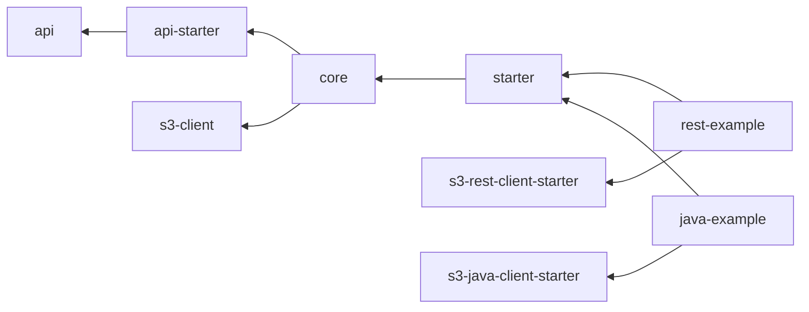

# Email Integration

Integration for sending text and html emails with attachments. Uses [s3-integration](./s3.md) for file handling.

## Modules

The modules follow the [default naming convention](./index.md#naming-conventions).

Beside the default modules there are following additional:

- email-api: Implementation of core email functionality. Will be included in core in the future.
- rest-example: Example which uses s3-rest-client.
- java-example: Example which uses s3-java-client.

### Dependency graph

The following graph shows the relationships between the various modules and how they interact and rely on each other.



## Usage

```xml

<dependencies>
    <dependency>
        <groupId>de.muenchen.refarch</groupId>
        <artifactId>refarch-email-integration-starter</artifactId>
        <version>...</version>
    </dependency>
</dependencies>
```

and a [s3-integration starter](./s3.md#usage).

## Configuration

### refarch-email-integration-starter

| Property                                | Description                                       | Example                |
|-----------------------------------------|---------------------------------------------------|------------------------|
| `spring.mail.host`                      | Host of smtp server used for sending mails.       | `mail.example.com`     |
| `spring.mail.port`                      | Host of smtp server used for sending mails.       | `1025`                 |
| `spring.mail.username`                  | Username of smtp server.                          |                        |
| `spring.mail.password`                  | Password of smtp server.                          |                        |
| `refarch.mail.from-address`             | Default from address used when sending mails.     | `test@example.com`     |
| `refarch.mail.default-reply-to-address` | Default reply to address used when sending mails. | `no_reply@example.com` |

In addition, properties of selected [s3-integration starter](./s3.md#usage).
