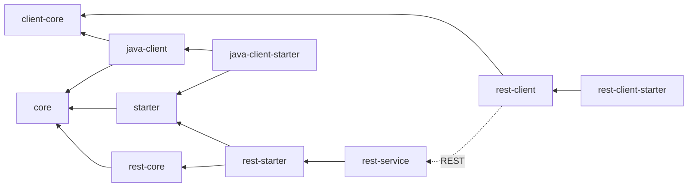

# S3 Integration

Integration for CRUD operations on a S3 storage. Also used for file handling in other integrations.

## Modules

The S3 integration follows the [default naming conventions](./index.md#naming-conventions).

Beside the default integration it contains different client libraries for accessing the integration. The client
libraries are especially provided for usage in other integrations.

- REST: The REST client uses the REST endpoints of the `s3-rest-service` module to manage data in S3.
- Java: The Java client directly uses the in ports of the `s3-core` module.

### Dependency graph

The following graph shows the relationships between the various modules and how they interact and rely on each other.



## Usage

```xml

<dependencies>
    <!-- REST -->
    <!-- requires running instance of s3-rest-service -->
    <dependency>
        <groupId>de.muenchen.refarch</groupId>
        <artifactId>refarch-s3-integration-rest-starter</artifactId>
        <version>...</version>
    </dependency>
    <!-- or Java -->
    <dependency>
        <groupId>de.muenchen.refarch</groupId>
        <artifactId>refarch-s3-integration-java-starter</artifactId>
        <version>...</version>
    </dependency>
</dependencies>
```

## Configuration

Following are the properties to configure the different modules. Some of them are custom defined and others are synonyms
for spring package properties.
Whether a property is an alias can be checked in the corresponding `application.yml` of each module.

### s3-integration-rest-service

| Property                                        | Description                       | Example          |
|-------------------------------------------------|-----------------------------------|------------------|
| `refarch.s3.url`                                | URL of S3 endpoint to connect to. | `s3.example.com` |
| `refarch.s3.bucket-name`                        | Name of the bucket to connect to. | `refarch-bucket` |
| `refarch.s3.access-key`                         | Access key to use for connection. |                  |
| `refarch.s3.secret-key`                         | Secret key to use for connection. |                  |
| `refarch.s3.initial-connection-test` (optional) | Test connection to S3 at startup.  | `true` (default) |

For authenticating the different endpoints OAuth 2.0 authentication needs to be configured.
See below example or the [according Spring documentation](https://docs.spring.io/spring-security/reference/servlet/oauth2/index.html#oauth2-resource-server).

```yml
spring:
  security:
    oauth2:
      resourceserver:
        jwt:
          issuer-uri: https://sso.example.com/auth/realms/refarch
security:
  oauth2:
    resource:
      user-info-uri: ${spring.security.oauth2.resourceserver.jwt.issuer-uri}/protocol/openid-connect/userinfo
```

### s3-integration-java-client-starter

| Property                                                   | Description                                           | Example                  |
|------------------------------------------------------------|-------------------------------------------------------|--------------------------|
| `refarch.s3.client.max-file-size` (optional)               | Single file limit for up- or downloading in byte.     | `10MB`                   |
| `refarch.s3.client.max-batch-size` (optional)              | Limit for up- or downloading a list of files in byte. | `100MB`                  |
| `refarch.s3.client.supported-file-extensions.*` (optional) | Map of allowed file extensions for up- and download.  | `pdf: "application/pdf"` |

### s3-integration-rest-client-starter

All properties of [s3-integration-java-client-starter](#s3-integration-java-client-starter) and following:

| Property                                 | Description                                                                | Example                                       |
|------------------------------------------|----------------------------------------------------------------------------|-----------------------------------------------|
| `refarch.s3.client.document-storage-url` | URL to the RefArch S3 integration service.                                 | `http://s3-integration-service:8080`          |
| `refarch.s3.client.enable-security`      | Switch to enable or disable OAuth 2.0 authentication against S3 service.      | `true`                                        |

For authentication against the `s3-service` a OAuth 2.0 registration with the name `s3` needs to be provided.
See following example or the [according Spring documentation](https://docs.spring.io/spring-security/reference/servlet/oauth2/index.html#oauth2-client).

```yml
spring:
  security:
    oauth2:
      client:
        provider:
          sso:
            issuer-uri: https://sso.example.com/auth/realms/refarch
            user-info-uri: ${spring.security.oauth2.client.provider.sso.issuer-uri}/protocol/openid-connect/userinfo
            jwk-set-uri: ${spring.security.oauth2.client.provider.sso.issuer-uri}/protocol/openid-connect/certs
            # used for RequestResponseLoggingFilter in s3-rest-service
            # only required if filter is explicitly enabled
            user-name-attribute: user_name
        registration:
          s3:
            provider: sso
            authorization-grant-type: client_credentials
            client-id: refarch_client
            client-secret: client_secret_123
            # profile required for username used in s3-rest-service RequestResponseLoggingFilter
            # openid required for user info endpoint used in s3-rest-service JwtUserInfoAuthenticationConverter
            # both scopes are only required if the according functions are explicitly used
            scope: profile, openid
```
