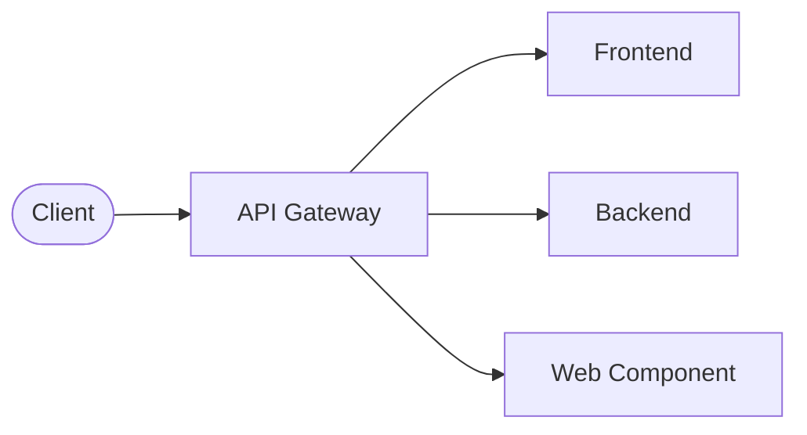

# Overview

The reference architecture of it@M (further referred to as "RefArch") provides a frame for developing web applications and integration components.
It's based on [Spring](https://spring.io/) as backend framework and [Vue.js](https://vuejs.org/) as frontend framework. [Apache Camel](https://camel.apache.org/) is used as integration framework.

This website contains documentation for the general topics about the reference architecture, as well as content about generic and ready-to-use components.
Additionally, there is [documentation for repository templates](https://refarch-templates.oss.muenchen.de), which is especially relevant when developing own applications with the RefArch.

The following sections further describe the architecture and its involved components.

## Architecture

The RefArch is a microservice-based architecture where each service can be scaled and developed independently.
Following up is a description of the different components and a visualization of the connections between them.

Most applications consist of an API gateway, a frontend (served by a webserver) and a backend component.
Besides that there can be cases where modular frontends through web components, multiple frontends or multiple backends are desired.

### API Gateway

The API gateway is a ready-to-use component and the only exposed interface for accessing the application.
It manages all requests and routes them to the respective development components like frontend and backend.
Besides that, it also handles cross-cutting concepts like authentication using a SSO.

See [API Gateway](./gateway.md) for further information.

### Frontend

The frontend provides the application UI and is developed with Vue.js. It calls the backend (via the API gateway) for reading and modifying data.
It's developed separate for each application and therefore a default template is provided.

More on how to use the template can be found in the [RefArch templates documentation](https://refarch-templates.oss.muenchen.de/getting-started.html#frontend-web-components).

### Backend

The backend provides a REST-API for reading and modifying application data, handles business logic and access to databases.
Like the frontend the backend is also provided as a template.

More on how to use the template can be found in the [RefArch templates documentation](https://refarch-templates.oss.muenchen.de/getting-started.html#backend-eai).

### Web Component

The web components template enables development of modular frontend components which can be integrated into other applications.
This concept is also known as micro frontends. By default, most applications won't require this template.

More on how to use the template can be found in the [RefArch templates documentation](https://refarch-templates.oss.muenchen.de/getting-started.html#frontend-web-components).

## Enterprise Application Integration (EAI)

Beside the development of web applications, the RefArch also provides a template for enterprise application integration (EAI).
This enables integration between existing applications. By default, most applications won't require this template.

More on how to use the template can be found in the [RefArch templates documentation](https://refarch-templates.oss.muenchen.de/getting-started.html#backend-eai).
