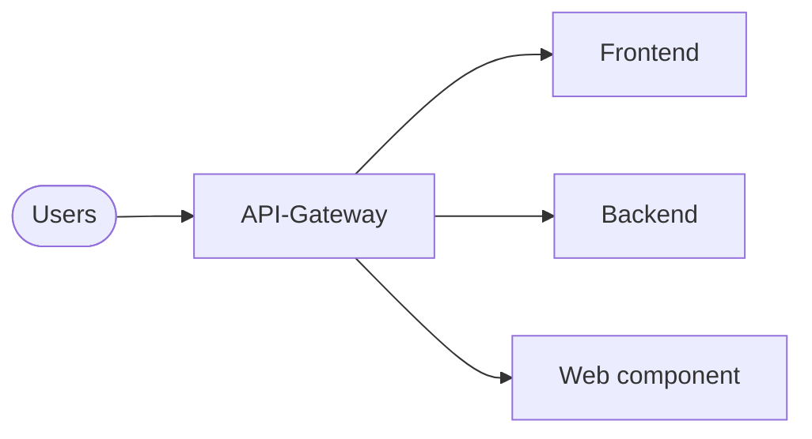

# Overview

The reference architecture (RefArch) of it@M provides a baseframe for developing web applications.
It's based on [Spring](https://spring.io/) as backend and [Vue.js](https://vuejs.org/) as frontend framework.

Beside this generic and ready to use components documentation there is also [the documentation for all the templates](https://refarch-templates.oss.muenchen.de).

In the following the architecture and the different components are described.

## Architecture

The RefArch is a microservice architecture where each service can be scaled and developed independent. 
In the following these different services and their connections with each other are visualized and described.

The most applications consist of the api gateway, a frontend and a backend.
Besides that there can be variations with web components or multiple frontends or backends.

### API-Gateway

The API gateway is a ready to use component and the only exposed interface for accessing the application.
It manages all requests and routes them to the independent services.

See [API-Gateway](./gateway.md) for further information.

### Frontend

The frontend provides the ui and is developed with Vue.js. It calls the backend for reading and modifying data.
It's developed separate for each application and started from a default template.

The template is described [here](https://refarch-templates.oss.muenchen.de/frontend).

### Backend

The backend provides an REST-API for reading and modifying application data.
Like the frontend the backend is also started from a template.

The according template is described [here](https://refarch-templates.oss.muenchen.de/backend).

### Web component

In addition to the frontend there is also a template for developing web components which then can be used in other applications.

Further information regarding the web component template can be found [here](https://refarch-templates.oss.muenchen.de/webcomponent).

## Application integration (EAI)

Beside the development of web application the RefArch also provides presets for enterprise application integration (EAI).
This enables to interconnect two existing applications.

The according templates and documentation can he found [here](https://refarch-templates.oss.muenchen.de/eai).
