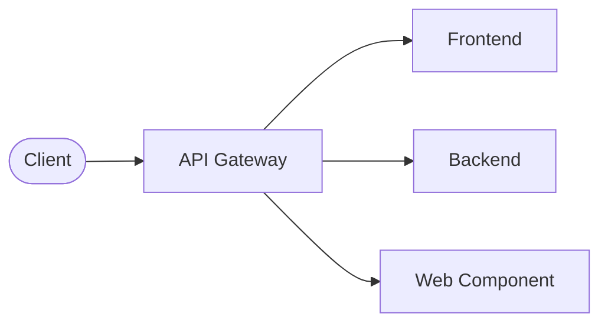

# Overview

The reference architecture of it@M (further referred to as "RefArch") provides a frame for developing web applications and integration components.
It's based on [Spring](https://spring.io/) as backend framework and [Vue.js](https://vuejs.org/) as frontend framework. [Apache Camel](https://camel.apache.org/) is used as integration framework.

This website contains documentation for the general topics about the reference architecture, the refarch templates used to create new projects, as well as content about generic and ready-to-use components.

The detailed architecture documentation is split into dedicated pages in the [Architecture](./architecture/index.md) section. Architecture decisions are documented separately in the [Architecture Decision Records](./cross-cutting-concepts/adr/index.md).

## Architecture

The RefArch is a microservice-based architecture where each service can be scaled and developed independently.
Most applications consist of an API gateway, a frontend and one or more backend services. Depending on the use case, modular frontends, dedicated integration services or additional backend services can be added without changing the basic structure.

```mermaid
flowchart LR
    u([Client])
    g[API Gateway]
    f[Frontend]
    b[Backend]
    w[Web Component]
    u --> g
    g --> f
    g --> b
    g --> w
```

- [Architecture details](./architecture/index.md)
- [API Gateway](./gateway.md)
- [Templates](./templates/index.md)
- [Integrations](./integrations/index.md)
- [Security](./cross-cutting-concepts/security.md)
- [Architecture Decision Records](./cross-cutting-concepts/adr/index.md)
