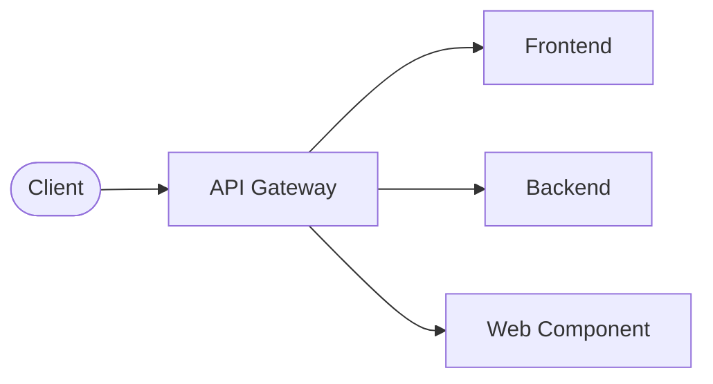

# Overview

The reference architecture of it@M (further referred to as "RefArch") provides a frame for developing web applications and integration components.
It's based on [Spring](https://spring.io/) as backend framework and [Vue.js](https://vuejs.org/) as frontend framework. [Apache Camel](https://camel.apache.org/) is used as integration framework.

This website contains documentation for the general topics about the reference architecture, the refarch templates used to create new projects, as well as content about generic and ready-to-use components.

The detailed architecture documentation is split into dedicated pages in the [Architecture](./architecture/index.md) section. Architecture decisions are documented separately in the [Architecture Decision Records](architecture/adr/index.md).

## Architecture

The RefArch is a microservice-based architecture where each service can be scaled and developed independently.
Most applications consist of an API gateway, a frontend and one or more backend services. Depending on the use case, modular frontends, dedicated integration services or additional backend services can be added without changing the basic structure.

```mermaid
flowchart LR
    u([Client])
    g[API Gateway]
    f[Frontend]
    b[Backend]
    w[Web Component]
    u --> g
    g --> f
    g --> b
    g --> w
```

### API Gateway

The API gateway is a ready-to-use component and the only exposed interface for accessing the application.
It manages all requests and routes them to the respective development components like frontend and backend.
Besides that, it also handles cross-cutting concepts like authentication using a SSO.

See [API Gateway](./gateway.md) for further information.

### Templates

- **Frontend**: The frontend provides the application UI and is developed with Vue.js. It calls the backend (via the API gateway) for reading and modifying data.
  It's developed separate for each application and therefore a default template is provided.
- **Backend**: The backend provides a REST-API for reading and modifying application data, handles business logic and access to databases.
  Like the frontend the backend is also provided as a template.
- **Web Component**: The web components template enables development of modular frontend components which can be integrated into other applications.
  This concept is also known as micro frontends. By default, most applications won't require this template.
- **Enterprise Application Integration (EAI)**: Beside the development of web applications, the RefArch also provides a template for enterprise application integration (EAI).
  This enables integration between existing applications. By default, most applications won't require this template.

## See further details here

- [Architecture details](./architecture/index.md)
- [Architecture Decision Records](architecture/adr/index.md)
- [API Gateway](./gateway.md)
- [Templates](./templates/index.md)
- [Integrations](./integrations/index.md)
- [Security](./cross-cutting-concepts/security.md)
