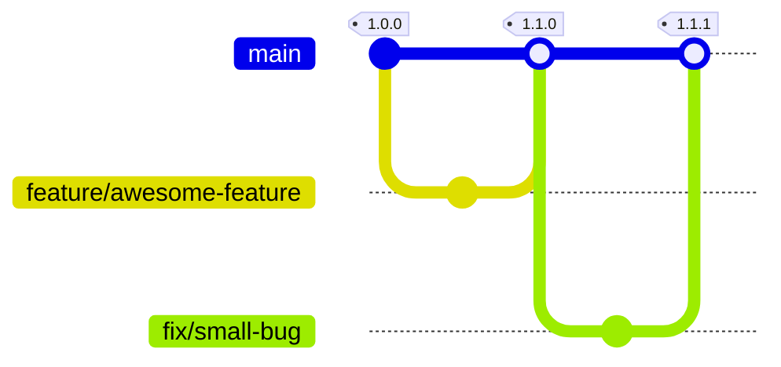
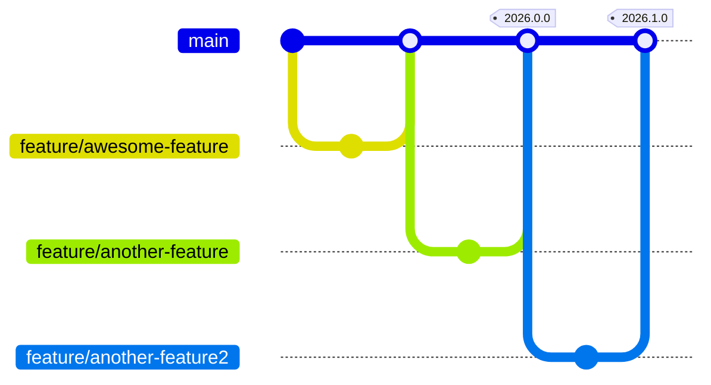

# Release Strategy

This document describes the release strategies for the RefArch ready-to-use components and the [templates](../templates/index.md).

## RefArch (Gateway, Tools, Integrations, ...)

- **Branching Model**:
  - Single `main` branch only.
- **Versioning**:
  - [Semantic Versioning](https://semver.org/) is used (`MAJOR.MINOR.PATCH`).
- **Development and Release**:
  - Features are merged directly into the `main` branch.
  - Releases are made from the `main` branch as needed.

## RefArch Templates

- **Branching Model**:
  - `main`: active development branch where new features are merged.
- **Versioning Scheme**:
  - Versions follow the format: `<year>.<counter>.<patch>`
    - `<year>`: year of the release (e.g., 2026)
    - `<counter>`: incremented twice a year (e.g., 0, 1)
    - `<patch>`: patch number for bug fixes
- **Release Process**:
  1. New features are merged into the `main` branch.
  2. Approximately every six months, a release is created from the `main` branch with the new version number.

::: warning
The `main` branch can contain features which are not part of any release yet.
However, these should already be described in this documentation.
:::

